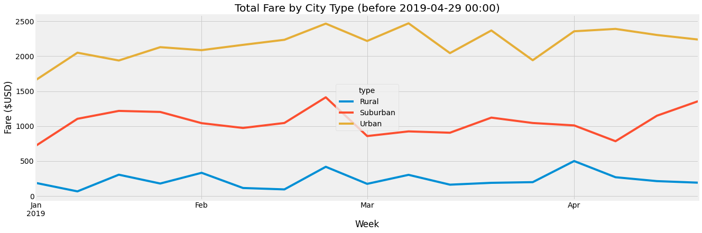
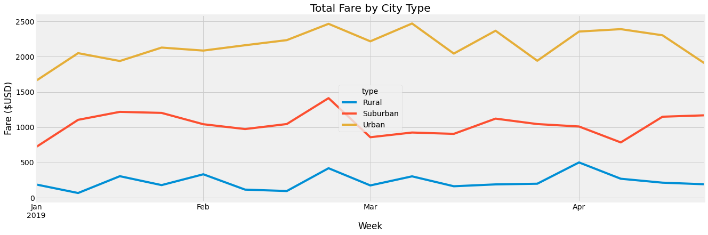

# PyBer Analysis
This project focused on the application of Pandas, NumPy, and Matplotlib libraries, and how we leveraged their useful functions for performing efficient data analytics and data visualization.

## Table of Contents
- [Overview of Project](#overview-of-project)
  - [Resources](#resources)
  - [Challenge Overview](#challenge-overview)
  - [GitHub Repo Branches](#github-repo-branches)
- [Implementation and Testing](#implementation-and-testing)
  - [Deliverable 1](#deliverable-1)
  - [Deliverable 2](#deliverable-2)
- [Results and Summary](#results-and-summary)
  - [Deliverable 1 Summary](#deliverable-1-summary)
  - [Deliverable 2 Summary](#deliverable-2-summary)
  - [Concluding Remarks](#concluding-remarks)
- [References](#references)

## Overview of Project
Module 5 assignment triggered some rigorous exercises for understanding Python coding concepts by leveraging an interactive computational environment, Jupyter Notebook, and many of its integrated useful modules, functions, and data structures to perform analysis and visualization of the PyBer ride data for each city type more efficiently. We then applied some popular Python libraries, especially Pandas, NumPy, Statistics and Matplotlib, for crafting a multiple-line graph, which showed the total weekly fares for each city type, and a written report that summarized how the data differs by city type and how those differences can be used by decision-makers at PyBer.

### Resources
- Data Source: city_data.csv, ride_data.csv
- Source Code: Pyber_Challenge.ipynb (Pyber.ipynb is a subset)
- Output File: png files
- Software: [Matplotlib 3.5](https://matplotlib.org/3.6.0/users/release_notes.html), [conda 22.9.0](https://github.com/conda/conda/releases), [Python 3.9.12](https://docs.python.org/release/3.9.12/), [Visual Studio Code 1.71.1](https://code.visualstudio.com/updates/v1_71), or their newer releases

### Challenge Overview
Outline of our deliverables and a written report for presenting our results:

- ☑️ Deliverable 1: A ride-sharing summary DataFrame by city type.
- ☑️ Deliverable 2: A multiple-line chart of total fares for each city type.
- ☑️ Deliverable 3: A written report for the PyBer analysis (this ["README.md"](./README.md)).

### GitHub Repo Branches
All deliverables in Module 5 challenge are committed in this GitHub repo as outlined below.  
main branch  
|&rarr; [./README.md](./README.md)  
|&rarr; [./PyBer.ipynb](./PyBer.ipynb)  
|&rarr; [./PyBer_Challenge.ipynb](./PyBer_Challenge.ipynb)  
|&rarr; ./Resources/  
  &emsp; |&rarr; [./Resources/city_data.csv](./Resources/city_data.csv)  
  &emsp; |&rarr; [./Resources/ride_data.csv](./Resources/ride_data.csv)  
|&rarr; ./analysis/  
  &emsp; |&rarr; [./analysis/PyBer_fare_summary.png](./analysis/PyBer_fare_summary.png)  
  &emsp; |&rarr; [./analysis/PyBer_fare_summary429.png](./analysis/PyBer_fare_summary429.png)  
  &emsp; |&rarr; [./analysis/Fig1.png](./analysis/Fig1.png)  
  &emsp; |&rarr; [./analysis/Fig2.png](./analysis/Fig2.png)  
  &emsp; |&rarr; [./analysis/Fig3.png](./analysis/Fig3.png)  
  &emsp; |&rarr; [./analysis/Fig4.png](./analysis/Fig4.png)  
  &emsp; |&rarr; [./analysis/Fig5.png](./analysis/Fig5.png)  
  &emsp; |&rarr; [./analysis/Fig6.png](./analysis/Fig6.png)  
  &emsp; |&rarr; [./analysis/Fig7.png](./analysis/Fig7.png)  

## Implementation and Testing
During the full implementation phase, we ascertained all data collection, cleaning and verification steps by using `pd.read_csv()`, `pd.merge()`, `isnull().any(axis=1).index`, `duplicated().sum()`, `df.info()`, and so on. We verified that the merged city and ride data were clean and consisted of 2375 rows times 6 columns. A few code refactoring approaches that might be unique when analyzing and visualizing the data are summarized below.

### Deliverable 1
- After data cleaning steps, I created an array `area_type = pyber_df["type"].unique()` that contains all unique city types and reused the array for looping through city types and the corresponding DataFrame, Series, list, label, etc. without rewriting similar code several times. Reusing the `area_type` array was more efficient for manipulating `plt.boxplot()` and `plt.pie()` with multiple groupings, and several other Matplotlib functions that better handle 1-dimensional data and indexes. Let us provide an example below.

```
# align x_labels and colors according to city types
x_labels = area_type[::-1]
colors = ["gold", "lightskyblue", "lightcoral"]
plt.pie(type_percents, labels=x_labels, colors=colors, explode=[0, 0, 0.1], autopct='%.1f%%', shadow=True, startangle=150)
```

- We summarized the total number of rides, total number of drivers, total fares, average fare per ride, and average fare per driver for each city type in a DataFrame named *pyber_summary_df*. For outputting a ride-sharing summary DataFrame by city type, I used simplified code snippets as described below.
  - Dict keys: column labels that mimicked **Deliverable 1** requirements. We deleted the index name `type` from the resulting DataFrame afterward.
  - Dict values: reuse of those 1D-data (`pandas.core.series.Series` data in this case) that we previously created for effectively plotting bubble, scatter, and pie charts by city type such as *type_ride_count*.
  - We applied certain formats to our data by using `iloc` and `applymap()` method.

```
#  6. Create a PyBer summary DataFrame. 
sum_data = {'Total Rides': type_ride_count, 'Total Drivers': type_total_drivers_cdf, 'Total Fares': type_total_fares,
            'Average Fare per Ride': type_avg_fare_a_ride, 'Average Fare per Driver': type_avg_fare_a_driver}
pyber_summary_df = pd.DataFrame(sum_data)
#  7. Cleaning up the DataFrame. Delete the index name
pyber_summary_df.index.name = None
#  8. Format the columns.
pyber_summary_df.iloc[:, :2] = pyber_summary_df.iloc[:, :2].applymap('{:,.0f}'.format)
pyber_summary_df.iloc[:, 2:] = pyber_summary_df.iloc[:, 2:].applymap('${:,.2f}'.format)
```

### Deliverable 2
I tested two scenarios for accomplishing **Deliverable 2** because a full week is generally counted from Monday 00:00 to Sunday 23:59 (refer to [ISO 8601 Standard - date and time format](https://en.wikipedia.org/wiki/ISO_8601)). The sample image provided by PyBer Company was off by one day in the week that ended on Sunday 2019-04-28 23:59, though both scenarios could be correct depending on how a company defines the start datetime and the end datetime of a customized week.

1. Scenario#1: `sum_pyber_pivot.loc['2019-01-01':'2019-04-29']` only included data before 2019-04-29 00:00:00 (see Fig. 8).
2. Scenario#2: `sum_pyber_pivot.loc['2019-01-01':'2019-04-28']` only included data before 2019-04-28 00:00:00. This was accidentally used by PyBer Company for creating its multiple-line chart of total fares for each city type. Fig. 9 is also included here just for clarifying my observation of a slight difference between our results.

```
# 4. Create a new DataFrame from the pivot table DataFrame using loc on the given dates, '2019-01-01':'2019-04-29'.
sum_pyber_pivot_df429 = sum_pyber_pivot.loc['2019-01-01':'2019-04-29']
# Minor revision of the end-date to align with image in the instruction
sum_pyber_pivot_df = sum_pyber_pivot.loc['2019-01-01':'2019-04-28']
display(sum_pyber_pivot_df.tail(), sum_pyber_pivot_df429.tail())
```

The full implementation based on our pseudocode and the refactored code can be found in [PyBer_Challenge.ipynb](./PyBer_Challenge.ipynb).

## Results and Summary
Let us assess our results and summary that meet the requirements of each deliverable in the following sections. Other preliminary analysis results are viewable and saved under the *analysis* folder within this GitHub repo (see [GitHub Repo Branches](#github-repo-branches)).

### Deliverable 1 Summary
**Table 1** concluded a ride-sharing summary DataFrame by city type. Data were formatted according to the request from decision-makers at PyBer.

<b>Table 1. Ride-sharing Summary DataFrame by City Type</b>

|	         | Total Rides | Total Drivers | Total Fares | Average Fare per Ride | Average Fare per Driver |
| :---     |  ---:       |  ---:         |  ---:       |  ---:                 |  ---:                   |
| Rural	   |   125       |    78         |  $4,327.93  | $34.62                | $55.49                  |
| Suburban |   625       |   490         | $19,356.33  | $30.97                | $39.50                  |
| Urban	   | 1,625       | 2,405         | $39,854.38  | $24.53                | $16.57                  |

### Deliverable 2 Summary
**Table 2** provided a comparison of the two possible scenarios for generating the multiple-line chart of total fares for each city type.

1. Scenario#1: The final week, which ended on Sunday 2019-04-28 23:59, included the total fare up to 2019-04-28 19:35:03 (**before 2019-04-29 00:00**) when we generated the chart by using `sum_pyber_pivot.loc['2019-01-01':'2019-04-29']` (see Fig. 8).
2. Scenario#2: The final week, which ended on Sunday 2019-04-28 23:59, only included the total fare up to 2019-04-27 23:52:44 (**before 2019-04-28 00:00**) when we generated the chart by using `sum_pyber_pivot.loc['2019-01-01':'2019-04-28']` (see Fig. 9).

<b>Table 2. Results from `resample('W')` Method Comparing Two Possible Scenarios</b>

| Case study | Week       | Rural  | Suburban | Urban   | Image  |
| :---       | ---:       |  ---:  |  ---:    |  ---:   | ---:   |
| Scenario#1 | 2019-04-28 | 191.85 | 1357.75  | 2238.29 | Fig. 8 |
| Scenario#2 | 2019-04-28 | 191.85 | 1169.04  | 1909.51 | Fig. 9 |

\
**Fig. 8 Fare summary by city type of PyBer Company**

\
**Fig. 9 Fare summary by city type of PyBer Company**

### Concluding Remarks
Here are the executive summary and the ride-sharing summary DataFrame by city type in percentage (**Table 3**) for our decision-makers at PyBer.

- Ride count data were fairly close to normal distributions, though total rides were significantly higher in the urban city type (**68.42%** of total rides) and significantly lower in the rural city type (only **5.26%** of total rides). Total number of drivers and total fares followed the same trends.
- Average fare per ride is lower for urban city type (**-18.34%** lower vs the average fare/ride of all city types combined) compared to the other city types, probably because more customers and more drivers were available for the PyBer ride-sharing services in the urban city type. Average fare per driver followed the same trends, which is **-55.44%** lower in the urban city type than the average fare/driver of all city types combined.
- However, about **1.48** drivers per customer and **80.89%** of total drivers competing to serve ride-sharing users might be some unseen factors that triggered average fare per ride and average fare per driver to be much lower in the urban city type. There were only **0.78** drivers per customer in the suburban city type and **0.62** drivers per customer in the rural city type, which suggested that total number of drivers could be insufficient to meet customers' demands in either suburban or rural areas. This conclusion was drawn based on the assumption that we had no data related to distance driven for each ride that could be further analyzed.

<b>Table 3. Ride-sharing Summary DataFrame by City Type in Percentage</b>

|	City Type | % of Total Rides | % of Total Drivers | % of Total Fares | % of Fare/Ride | % of Fare/Driver |
| :---      |  ---:            |  ---:              |  ---:            |  ---:          |  ---:            |
| Rural     |  5.26%           |  2.62%             |  6.81%           |  15.25%        |  49.22%          |
| Suburban  | 26.32%           | 16.48%             | 30.46%           |   3.10%        |   6.22%          |
| Urban     | 68.42%           | 80.89%             | 62.72%           | -18.34%        | -55.44%          |

As a final checkpoint, I reset the Matplotlib settings and style sheets, so that we could rerun the Jupyter Notebook code and review our analysis results repeatedly without being unintentionally corrupted by the unwanted style used for customized mpl settings or generating the multiple-line graphs. To overcome problems with axes and labels, I had to use `bbox_inches='tight', facecolor='w'` options for displaying axes and labels more beautifully when saving png image files.

```
# Reimport Matplotlib.
import matplotlib
# Reset the style from Matplotlib to default.
matplotlib.rcParams.update(matplotlib.rcParamsDefault)
```

```
# Save the figure.
plt.savefig('./analysis/PyBer_fare_summary.png', bbox_inches='tight', facecolor='w')
```

## References
[Pandas User Guide](https://pandas.pydata.org/pandas-docs/stable/user_guide/index.html#user-guide)\
[Matplotlib Stable Release](https://matplotlib.org/3.6.0/users/release_notes.html)\
[Best way to set index name in Python Pandas DataFrame](https://stackoverflow.com/questions/58693381/best-way-to-set-index-name-in-python-pandas-dataframe)\
[Difference between map, applymap, and apply methods in pandas](https://stackoverflow.com/questions/19798153/difference-between-map-applymap-and-apply-methods-in-pandas)\
[ISO 8601 Standard - date and time format](https://en.wikipedia.org/wiki/ISO_8601)
